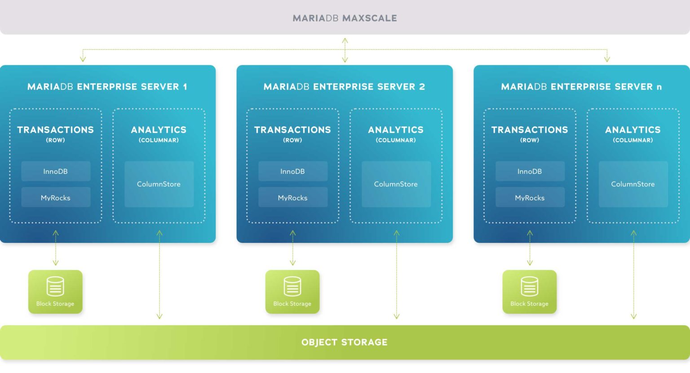
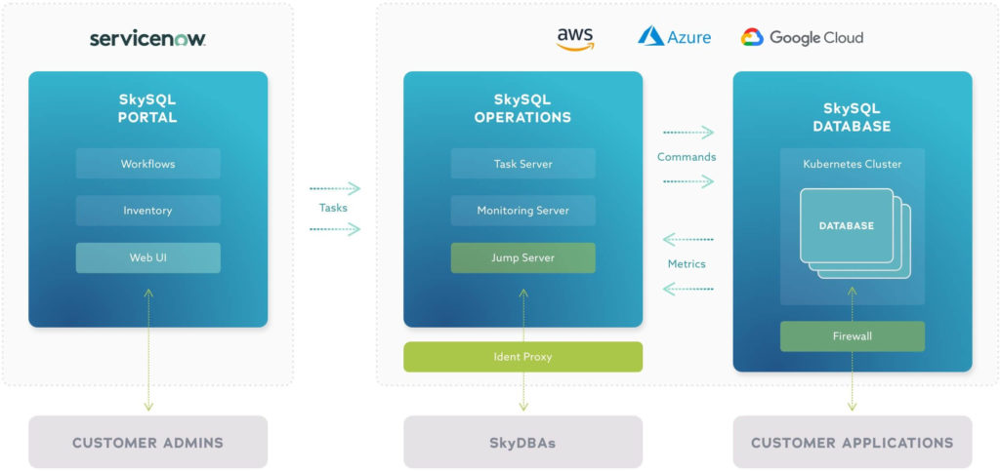

# Getting Started with MariaDB

[MariaDB](https://mariadb.com) is a community-developed, commercially supported relational database management system. 

This purpose of this README is to provide you with a brief introduction to the [MariaDB database products](https://mariadb.com/products/), information on how to get started and additional resources you can use to learn more about MariaDB.

## Table of Contents
1. [MariaDB Database Products](#products)
    1. [MariaDB Community Server](#community)
    2. [MariaDB Enterprise](#enterprise)
    3. [MariaDB SkySQL](#skysql)
2. [Helpful Resources](#resources)
3. [Support and contribution](#support)

## MariaDB Database Products 

### MariaDB Community Server 

[MariaDB Community Server](https://mariadb.com/products/community-server/) is the open source relational database loved by developers all over the world. It is compatible with MySQL, Oracle and other SQL databases, and is guaranteed to stay open source forever. Key features include modern SQL, pluggable storage engines, columnar storage for analytics and high availability.

#### Get Started

* [Download and install MariaDB Community directly from mariadb.com](https://mariadb.com/downloads/)
* [Using the official Docker image](https://hub.docker.com/_/mariadb)

### MariaDB Enterprise Server 

[MariaDB Enterprise](https://mariadb.com/products/enterprise/) is the complete, production-grade open source database solution. It supports [transactional](https://mariadb.com/products/mariadb-platform-transactional/), [analytical](https://mariadb.com/products/mariadb-platform-analytical/) and combination workloads as well as relational, JSON and hybrid data models. MariaDB Enterprise can deploy standalone databases and data warehouses to fully distributed SQL, which executes millions of transactions per second and performs interactive, ad hoc analytics on billions of rows.

    <kbd>
        
    </kbd>

#### Get Started

* [Download and install MariaDB Enterprise directly from mariadb.com](https://mariadb.com/downloads/enterprise/)

### MariaDB SkySQL 

[MariaDB SkySQL](https://mariadb.com/products/skysql/) is the first and only database-as-a-service (DBaaS) to bring the full power of MariaDB Enterprise to the cloud, combining powerful features and world-class support with unrivaled ease of use and groundbreaking innovation. Built for mission-critical applications and enterprise governance, SkySQL augments automation with the human expertise and experience needed to support and manage mission-critical deployments in the cloud – whether it’s a single development database or thousands of production databases.

    <kbd>
        
    </kbd>

#### Get Started

* [Launch a fully-managed cloud database with MariaDB SkySQL](https://mariadb.com/products/skysql/get-started/)

## Helpful Resources 

* [Official MariaDB Documentation](https://mariadb.com/docs)
* MariaDB product pages
    * [Community Server](https://mariadb.com/products/community-server/)
    * [Enterprise](https://mariadb.com/products/enterprise/)
    * [SkySQL](https://mariadb.com/products/skysql/)

## Support and Contribution 

Please feel free to submit PR's, issues or requests to this project project or projects within the [official MariaDB Corporation GitHub organization](https://github.com/mariadb-corporation).

If you have any other questions, comments, or looking for more information on MariaDB please check out:

* [MariaDB Developer Hub](https://mariadb.com/developers)
* [MariaDB Community Slack](https://r.mariadb.com/join-community-slack)

Or reach out to us diretly via:

* [developers@mariadb.com](mailto:developers@mariadb.com)
* [MariaDB Twitter](https://twitter.com/mariadb)